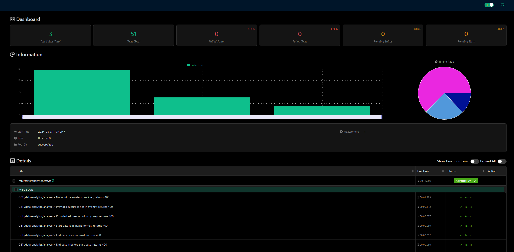

# JASSS Testing Microservice

## Deployment (Dev ONLY)

- Duplicate the `.env.template` as `.env` and fill out the env variables (necessary for testing).
- Follow the steps provided in the [Terraform Readme.](../terraform/README.md)
- `terraform plan` to check the changes that Terraform will apply. (optional)
- `terraform apply` and follow the instructions for inputting the necessary keys. Terraform will handle all of the deployment and pushing to ECR for this service.

If you wish to test your service as it would be when deployed into production, you may run the following commands:
`docker build -t jasss_testing_microservice .`
`docker run -p 8080:8080 jasss_testing_microservice`

**Staging and Production deployments are handled by the CD. DO NOT create workspaces for staging and prod to avoid confusion.**

## Env Variables

- `S3_ENDPOINT` - the URL to your S3 Endpoint
- `BUCKET` - the default bucket to point to in S3
- `DEFAULT_REGION` - default AWS region
- `AWS_ACCESS_KEY_ID` - AWS access key id
- `AWS_SECRET_ACCESS_KEY` - AWS secret access key
- `BASE_API_URL` - the base API Gateway URL (do not append the slash at the end)
- `STAGING_ENV` - the staging env for deployment, e.g. dev, staging prod

## About the Service

This service is responsible for running some E2E tests for our other microservices, including data-retrieval, data-analytics, data-preprocessing
and data-collection.

It provisions three routes:

| **Route**                | **Description**                                                                                                                                                                                                                                                                                    |
| ------------------------ | -------------------------------------------------------------------------------------------------------------------------------------------------------------------------------------------------------------------------------------------------------------------------------------------------- |
| `/testing/run-tests`     | Runs the tests, and returns a basic JSON report of the tests. Will also write the detailed HTML report to S3 to be fetched, and returns this key in the JSON as well. This will also ensure that there are no more than 50 reports in each folder in S3, by deleting the oldest report every time. |
| `/testing/list-reports`  | Lists the report keys present within the current staging environment in S3.                                                                                                                                                                                                                        |
| `/testing/fetch-reports` | Fetches a detailed report of previously run tests. **Parameters**: reportKey - the key of the report.                                                                                                                                                                                              |

A sample detailed HTML report is provided below.

